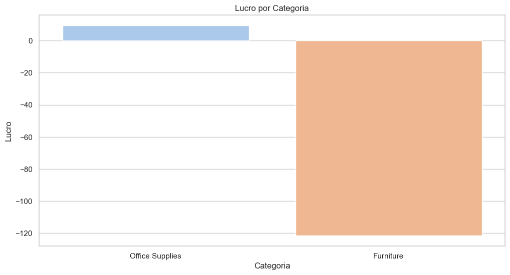
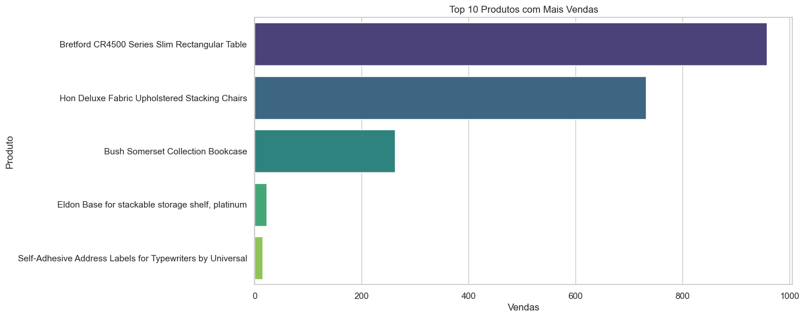
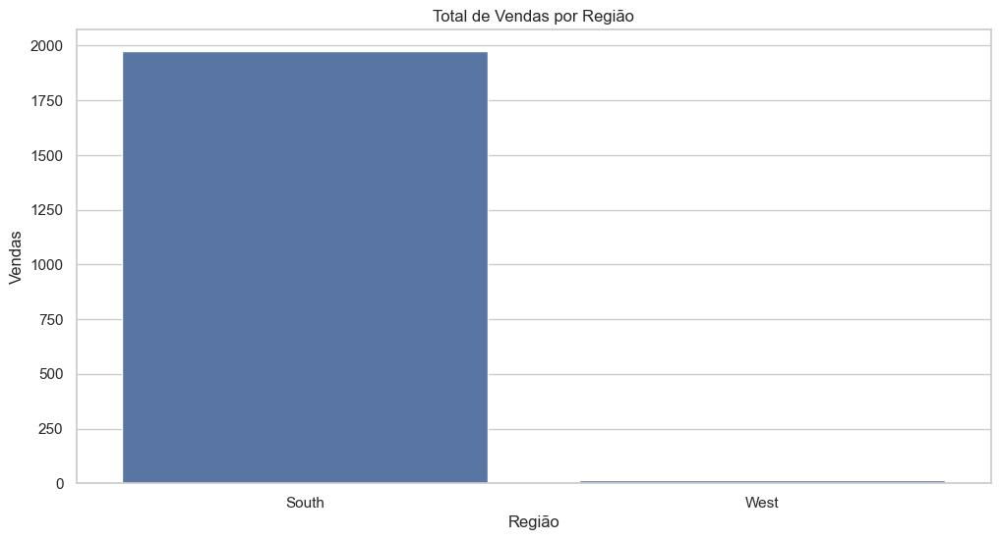

# Análise de Vendas — Projeto Superstore

## Visão Geral

Este projeto apresenta uma análise exploratória dos dados de vendas da Superstore, uma empresa fictícia. A base de dados contém transações comerciais com informações sobre vendas, lucros, descontos, categorias de produtos e regiões. O objetivo é extrair padrões e gerar insights que ajudem na tomada de decisões estratégicas.

## Estrutura do Projeto

```
analise_vendas/
│
├── dados/                 # Arquivos de dados (.csv)
├── imagens/               # Gráficos gerados (.png)
├── notebooks/             # Notebooks Jupyter (.ipynb)
└── README.md              # Documentação do projeto
```

## Conjunto de Dados

O arquivo utilizado, `Superstore.csv`, está localizado na pasta `dados/`. Ele inclui colunas como data, região, categoria, subcategoria, nome do produto, vendas, lucro, desconto, entre outras.

## Ferramentas Utilizadas

- Python 3.9+
- Jupyter Notebook
- Pandas para manipulação de dados
- Seaborn e Matplotlib para visualização
- Git para controle de versão

## Metodologia

A análise foi dividida nas seguintes etapas:

1. **Importação e Tratamento dos Dados**  
   - Leitura do arquivo CSV  
   - Verificação de valores ausentes e tipos de dados  
   - Limpeza e formatação da base

2. **Análise Exploratória (EDA)**  
   - Estatísticas descritivas  
   - Distribuição de vendas, lucros e descontos  
   - Desempenho por região e categoria  
   - Identificação dos produtos com maiores vendas

3. **Geração de Gráficos**  
   Os gráficos foram salvos na pasta `imagens/` para posterior consulta e uso em apresentações.

## Visualizações

A seguir, alguns dos principais gráficos gerados:

### Lucro por Categoria

  
*Gráfico de barras que mostra o volume total de vendas por categoria.*

### Top 10 Produtos Mais Vendidos

  
*Visualização dos 10 produtos com maior volume de vendas.*

### Vendas por Região

  
*Distribuição das vendas entre as regiões atendidas.*

## Principais Resultados

- A **região Sul** lidera em volume total de vendas.  
- A categoria **Tecnologia** apresenta os maiores lucros, enquanto **Móveis** lidera em volume de vendas.  
- Descontos elevados impactam negativamente a lucratividade.  
- Os 10 produtos mais vendidos representam aproximadamente 60% do faturamento.

## Como Executar o Projeto

Para rodar o projeto localmente:

1. Clone este repositório:

```bash
git clone https://github.com/seuusuario/analise_vendas.git
```

2. Acesse a pasta:

```bash
cd analise_vendas
```

3. (Opcional) Crie um ambiente virtual:

```bash
python -m venv venv
source venv/bin/activate       # Linux/Mac
venv\Scripts\activate        # Windows
```

4. Instale as bibliotecas necessárias:

```bash
pip install -r requirements.txt
```

5. Execute o Jupyter Notebook:

```bash
jupyter notebook notebooks/01_analise_superstore.ipynb
```

## Contato

- Diego  
- LinkedIn: [https://www.linkedin.com/in/seuusuario](https://www.linkedin.com/in/seuusuario)  
- GitHub: [https://github.com/seuusuario](https://github.com/seuusuario)

---

Este projeto faz parte do portfólio de Diego, com foco em análise de dados para oportunidades profissionais na área.
